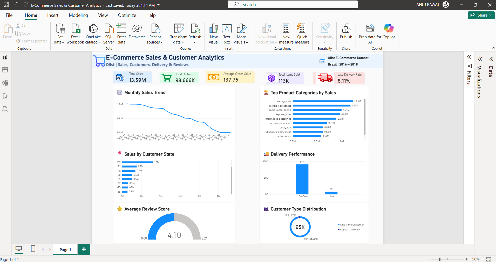

🛒 E-Commerce Sales & Customer Analytics

An end-to-end e-commerce analytics project using the Brazilian E-Commerce Public Dataset by Olist. The project analyzes sales performance, customer behavior, payment methods, delivery performance, and customer reviews to uncover business insights, backed by Python/Pandas analysis, SQL (PostgreSQL) queries, and an interactive Power BI dashboard.

🎯 Business Objectives

Analyze overall sales and order performance
Identify high-performing product categories
Understand customer purchase and retention behavior
Analyze payment method usage
Measure delivery performance
Understand the relationship between delivery time and customer satisfaction
Generate actionable business recommendations

🛠️ Tools & Technologies

Python · Pandas · NumPy · Matplotlib · Seaborn · PostgreSQL · SQL · Power BI · Google Colab

📊 Key KPIs

KPI	Value

Total Sales	------------------------------------> 13.59M

Total Orders -----------------------------------> 98.67K

Average Order Value	----------------------------> 137.75

Total Items Sold -------------------------------> 113K

Late Delivery Rate ----------------------------->	8.11%

Average Review Score --------------------------->	4.09

🔍 Analysis Performed

1. Sales Analysis — total sales/order volume, monthly & yearly trends, top-performing categories, price and freight patterns

2. Payment Analysis — payment method distribution, transaction count vs. value, installment patterns

3. Customer Analysis — one-time vs. repeat customer segmentation, spending comparison, state/city-wise distribution

4. Delivery Analysis — delivery duration, late delivery detection vs. estimated date, late delivery rate, review score comparison

5. Review Analysis — score distribution, sentiment classification (Positive/Neutral/Negative), score vs. delivery duration

6. SQL Analysis — order status breakdown, customer/order analysis, category-wise sales via JOINs, CTEs and window functions on PostgreSQL

7. Power BI Dashboard — interactive dashboard with KPIs, sales trends, top categories, delivery performance and customer segmentation

💡 Key Business Insights

Total product sales were 13.59M across approximately 98.7K orders.

beleza_saude (Beauty & Health) was the highest-selling category (~1.25M).

96.88% of customers were one-time buyers; only 3.12% were repeat customers.

Repeat customers spent 259.87 on average vs. 137.63 for one-time customers (~89% higher).

8.11% of delivered orders were late.

Average review score: 4.21 for on-time deliveries vs. 2.57 for late deliveries — a 1.64-point gap.

Review scores declined as delivery duration increased, especially beyond 21 days.

📌 Business Recommendations

Build retention campaigns to convert one-time customers into repeat buyers

Use personalized offers based on customer purchase behavior

Investigate and reduce late deliveries, especially longer-duration orders

Improve delivery operations to lift customer satisfaction

Focus inventory and marketing on high-performing categories

Use regional sales patterns for inventory planning and targeted marketing

📈 Power BI Dashboard

The .pbix file in this repo contains the interactive dashboard shown above, built from an order-level dataset engineered in the notebook (SQL + Pandas).

📁 Project Structure

E-Commerce-Sales-Customer-Analytics/

│

├── E_Commerce_Sales_&_Customer_Analytics.ipynb   # Full analysis: EDA, SQL, insights

├── E-Commerce Sales & Customer Analytics.pbix    # Power BI dashboard

├── dashboard_screenshot.png                      # Dashboard preview

└── README.md

🔧 How to Run

Download the dataset from Kaggle: Brazilian E-Commerce Public Dataset by Olist

Place the CSV files in the same folder as the notebook (or update the file paths in the notebook)

Open E_Commerce_Sales_&_Customer_Analytics.ipynb in Jupyter or Google Colab and run all cells

Open the .pbix file in Power BI Desktop to explore the dashboard interactively

📂 Dataset

This project uses [the Brazilian E-Commerce Public Dataset by Olist (Kaggle)](https://www.kaggle.com/datasets/olistbr/brazilian-ecommerce) — not included in this repo due to size; download separately using the link above.
